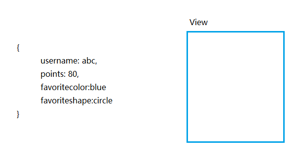
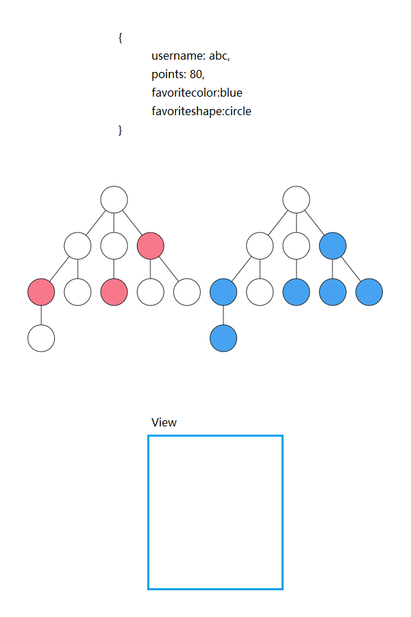
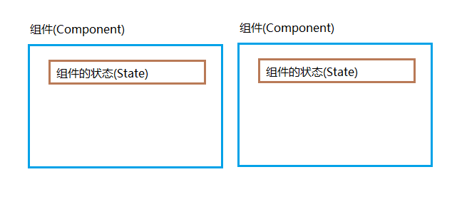
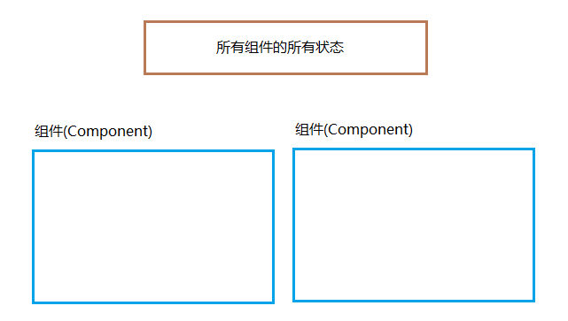
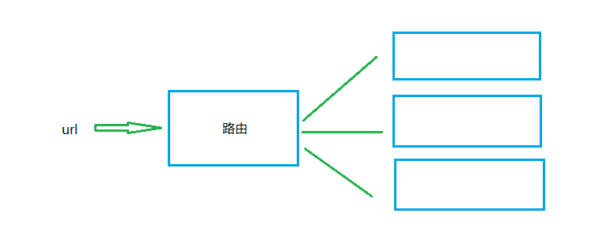
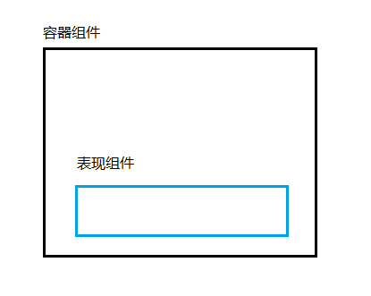

就依你React培训开篇，React基础。

# React是什么 #

Javascript库，以组件的方式来写。

 

# Virtual DOM  #

以前，每一次数据有变化，视图层也会相应发生变化。

现在，React的Virtual DOM概念的出现，变得有所不一样。Virtual DOM能对前后DOM状态有记忆。如果Virutal DOM没有变化，视图层就不需要渲染；有变化，视图层重新渲染。

如果一个视图中有很多组件，只对哪些状态发生变化的组件进行渲染。

 

# JSX #

JSX是React的使用的语法，在js中可以编写类似html的代码。

	var HelloWorld = React.createClass({
	    render: function(){
	        return (
	            
Hello World

	        )
	    }
	});

Babel不仅可以把es6转换成es5，还可以把JSX语法转换成js。

 

# 组件(Component)和状态(State) #

组件可以看作是一个模具，状态是数据。

# Flux和Redux是什么 #

用来管理状态的，Flux由Facebook推出，Redux在Flux的基础之上做了改进，是第三方作者开发的，更流行。

 

# React路由 #

匹配url和组件。

 

# 前端设计和前端开发如何配合？ #

React组件可以分成*表现组件*和*容器组件*。表现组件只负责显示，这个前端设计可以做；容器组件负责逻辑，前端开发做。

 

 

# 学习路线 #

**React开篇**

- 基础：https://github.com/darrenji/JynReactTraining01

 

**React基础**

- 简易上手：https://github.com/darrenji/ReactPracticesWithEggHeadFundamentals
- 播放YouTube视频：https://github.com/darrenji/ReactPracticesWithUdemyMordernReactWithRedux

 

**React路由**

- 基础：https://github.com/darrenji/ReactPracticesWithEggHeadReactRouter
- 案例，增删改，表单验证：https://github.com/darrenji/ReactPracticesWithUdemyBlog

 

**Redux**

- 基础，来自Redux作者，todo项管理：https://github.com/darrenji/ReactPracticesWithEggHeadGettingStartedwithRedux
- 高级，来自Redux作者，todo管理：https://github.com/darrenji/ReactPracticesWithEggHeadIdiomaticRedux
- 案例，展示Book列表：https://github.com/darrenji/ReactPracticesWithUdemyBookList
- 案例，获取天气API：https://github.com/darrenji/ReactPracticesWithUdemyWeather

 

**Higher Order Components**

- 案例：https://github.com/darrenji/ReactPracticesWithUdemyHOC

 

**Redux Middleware,介于Action和Reducer之间的一层**

- 基础：https://github.com/darrenji/ReactPracticesWithUdemyMiddlewares

 

**React验证**

- 服务端：https://github.com/darrenji/ReactPracticesWithUdemyAuthServerSide
- 客户端：https://github.com/darrenji/ReactPracticesWithUdemyAuthClientSide

 

**React同构直出**

- 原理：https://github.com/darrenji/ReactIsomorphicSimpleExample

 

**React设置样式**

- 案例：https://github.com/darrenji/ReactComponentStyling