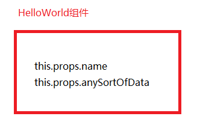
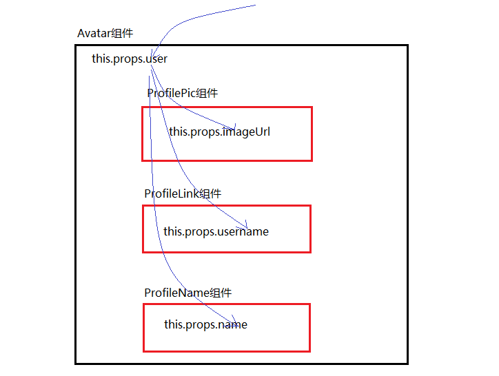

**pure function**

输入同样的参数，得到相同的结果；不依赖于作用域之外的变量。

	//slice执行的时候不是对原数组的操作，它会拷贝一份再操作
	var friends = ['a','b','c'];
	friends.slice(0,2); //['a', 'b']
	friends.slice(0,2); //['a', 'b']

	//对原数组的操作
	friends.splice(0, 2); //['a', 'b']
	friends.splice(0, 2); //['c']
	friends.splice(0, 2); //[]

以上，slice就是pure function, 而splice不是pure function.

 

**组件如何赋值？赋的值保存在哪里？**

> app/index.js

 

	var React = require('react');
	var ReactDOM = require('react-dom');
	
	var HelloWorld = React.createClass({
	    render: function(){
	        console.log(this.props)
	        return (
	            
Heddllo World

	        )
	    }
	});
	
	ReactDOM.render(
	    <HelloWorld name="darren" anySortOfData={36} />,
	    document.getElementById('app')
	)

 

> npm run start

 

> localhost:8080

 

**接下来就写一个组件。**

> app/index.js

 

	var React = require('react');
	var ReactDOM = require('react-dom');
	
	var HelloWorld = React.createClass({
	    render: function(){
	        return (
	            
Hello {this.props.name}

	        )
	    }
	});
	
	ReactDOM.render(
	    <HelloWorld name="darren" />,
	    document.getElementById('app')
	)
以上，HelloWord是个组件，当然也是个pure function,给它相同的参数输出相同的结果，并且HelloWorld不依赖于它自身作用域以外的任何变量。

 

> localhost:8080

 

**组件是如何嵌套的？**
> app/index.js

 

	var React = require('react');
	var ReactDOM = require('react-dom');
	
	
	var USER_DATA = {
	    name: 'darrenji',
	    username: 'darren',
	    image: 'https://avatars0.githubusercontent.com/u/2933430?v=3&s=460'
	}
	
	var ProfilePic = React.createClass({
	    render: function(){
	        return 
	    }
	});
	
	var ProfileLink = React.createClass({
	    render: function(){
	        return (
	            

	                <a href={'https://www.github.com/' + this.props.username}>
	                    {this.props.username}
	                </a>
	            

	        )
	    }
	});
	
	
	var ProfileName = React.createClass({
	    render: function(){
	        return (
	            

	                {this.props.name}
	            

	        )
	    }
	})
	
	var Avatar = React.createClass({
	    render: function(){
	        return (
	            

	                <ProfilePic imageUrl={this.props.user.image} />
	                <ProfileName name={this.props.user.name} />
	                <ProfileLink username={this.props.user.username} />
	            

	        )
	    }
	})
	
	
	
	ReactDOM.render(
	    <Avatar name="darren" user={USER_DATA} />,
	    document.getElementById('app')
	)

 

> localhost:8080

 

