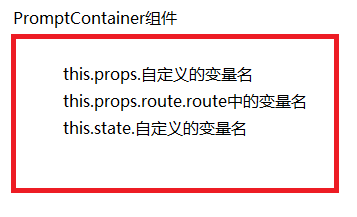

在输入一号参赛选手的时候，在文本框中输入的值保存在哪里呢？

 

每个组件都是有状态的。

 

> app/containers/PromptContainer.js

 

	var React = require('react');
	var transparentBg = require('../styles').transparentBg;
	
	var PromptContainer = React.createClass({
	    
	    getInitialState: function(){
	        return {
	                username: ''
	            }
	    },
	    onUpdateUser: function(e){
	        this.setState({
	            username: e.target.value
	        })
	    },
	    render: function(){
	       
	        return (
	            

	                <h3>{this.props.route.header}</h3>
	                

	                    <form>
	                        

	                           <input 
	                                className="form-control"
	                                placeholder="github username"
	                                onChange={this.onUpdateUser}
	                                value={this.state.username}
	                                type="text"
	                            />
	                        

	                    </form>
	                

	                

	                    <button
	                        className="btn btn-block btn-success"
	                        type="submit">
	                    继续
	                    </button>
	                

	            

	        )
	    }
	});
	
	module.exports = PromptContainer;

 

> http://localhost:8080/#/playerOne?_k=9sqth5

 

