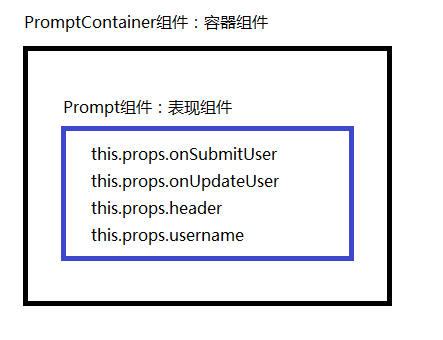

> app/containers/PromptContainer.js

 

在这里，简单划分下的话，包含两部分：一部分是用于展示页面，另一部分用于触发事件。

 

在React中，一个通常的做法是：把表现和实现逻辑分开。用来显示页面的叫"表现组件"，用来实现逻辑的，加"逻辑组件"。

 

> app/components目录下创建Prompt.js

 

	var React = require('react');
	var PropTypes = React.PropTypes;
	var transparentBg = require('../styles').transparentBg;
	
	function Prompt (props) {
	  return (
	    

	      <h3>{props.header}</h3>
	      

	        <form onSubmit={props.onSubmitUser}>
	          

	            <input
	              className='form-control'
	              onChange={props.onUpdateUser}
	              placeholder='Github Username'
	              type='text'
	              value={props.username} />
	          

	          

	            <button
	              className="btn btn-block btn-success"
	              type="submit">
	                go
	            </button>
	          

	        </form>
	      

	    

	  )
	}
	
	Prompt.propTypes = {
	  onSubmitUser: PropTypes.func.isRequired,
	  onUpdateUser: PropTypes.func.isRequired,
	  header: PropTypes.string.isRequired,
	  username: PropTypes.string.isRequired,
	}
	
	module.exports = Prompt;

 

> app/containers/PromptContainer.js

 

	var React = require('react');
	
	var Prompt = require('../components/Prompt');
	
	var PromptContainer = React.createClass({
	    contextTypes: {
	        router: React.PropTypes.object.isRequired
	    },
	    getInitialState: function(){
	        return {
	                username: ''
	            }
	    },
	    handleUpdateUser: function(e){
	        this.setState({
	            username: e.target.value
	        })
	    },
	    handleSubmitUser: function(e){
	        e.preventDefault();
	        console.log('haha')
	        var username = this.state.username;
	        this.setState({
	            username: ''
	        });
	        
	        if(this.props.routeParams.playerOne){
	            //导航到对决页
	            this.context.router.push({
	                pathname: '/battle',
	                query: {
	                    playerOne: this.props.routeParams.playerOne,
	                    playerTwo: this.state.username
	                }
	            })
	        } else {
	            //导航到第二个参赛选手
	            this.context.router.push('/playerTwo/' + this.state.username);
	        }
	    },
	    render: function(){
	       
	        return (
	            <Prompt 
	                onSubmitUser={this.handleSubmitUser}
	                onUpdateUser={this.handleUpdateUser}
	                header={this.props.route.header}
	                username={this.state.username}
	            />
	        )
	    }
	});
	
	module.exports = PromptContainer;

 

表现组件与容器组件是嵌套关系：

