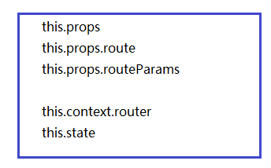
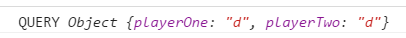
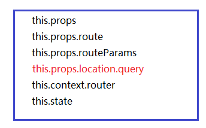

> 来到app/containers/PromptContainer.js

 

    if(this.props.routeParams.playerOne){
        //导航到对决页
        this.context.router.push({
            pathname: '/battle',
            query: {
                playerOne: this.props.routeParams.playerOne,
                playerTwo: this.state.username
            }
        })
    } else {
        //导航到第二个参赛选手
        this.context.router.push('/playerTwo/' + this.state.username);
    }

以上，当进入到/battle这个路由，即决胜页面的时候，传递出了两个查询字符串参数playerOne和playerTwo。在决胜页**如何获取查询字符串参数呢**？

 
关于组件，先来总结下：

- 组件所有自定义的字段都放在了this.props中
- 如果，我们想获取`<Route path='', header='' component={} />`中的header属性值，就使用`this.props.route`
- 如果，我们想获取`Route path='playerTwo/:playerOne' header='二号参赛选手' component={PromptContainer} />`中路由变量playerOne的值，就使用`this.props.routeParams`
- 如果，想在组件中获取全局的路由，就使用`this.context.router`
- 如果，想获取组件的状态，就使用`this.state`

 
有关组件，可能有了这样一个大致的轮廓：

 

接着，**我们在组件的componentDidMount声明周期事件内打印出查询字符串。**

> app/containers/ConfirmBattleContainer.js

 

	var React = require('react');
	var ConfirmBattle = require('../components/ConfirmBattle');
	
	var ConfirmBattleContainer = React.createClass({
	   contextTypes: {
	     router: React.PropTypes.object.isRequired  
	   },
	   getInitialState: function(){
	     return {
	         isLoading: true,
	         playerInfo:[]
	     }
	   },
	   componentDidMount: function(){
	       var query = this.props.location.query;
	       console.log('QUERY', query);
	   },
	   render: function(){
	       return (
	        <ConfirmBattle />
	       );
	   } 
	});
	
	module.exports = ConfirmBattleContainer;

 

> http://localhost:8080/#/battle?playerOne=d&playerTwo=d&_k=mx7ih4

 

 
现在，关于组件的大致轮廓，可以丰富一下：

