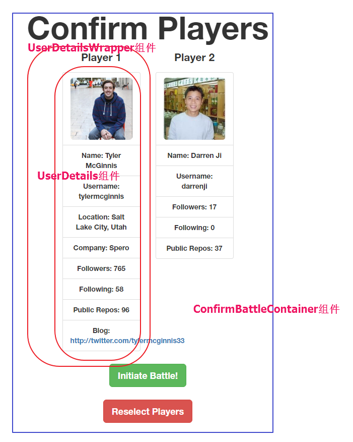

> app/components/UserDetails.js

 

	var React = require('react');
	var PropTypes = React.PropTypes
	
	function UserDetails (user) {
	  return (
	    

	      {!!user.score && <li className="list-group-item"><h3>Score: {user.score}</h3></li>}
	      <li className="list-group-item"> </li>
	      {user.info.name && <li className="list-group-item">Name: {user.info.name}</li>}
	      <li className="list-group-item">Username: {user.info.login}</li>
	      {user.info.location && <li className="list-group-item">Location: {user.info.location}</li>}
	      {user.info.company && <li className="list-group-item">Company: {user.info.company}</li>}
	      <li className="list-group-item">Followers: {user.info.followers}</li>
	      <li className="list-group-item">Following: {user.info.following}</li>
	      <li className="list-group-item">Public Repos: {user.info.public_repos}</li>
	      {user.info.blog && <li className="list-group-item">Blog: <a href={user.info.blog}> {user.info.blog}</a></li>}
	    

	  )
	}
	
	UserDetails.propTypes = {
	  score: PropTypes.number,
	  info: PropTypes.shape({
	    avatar_url: PropTypes.string.isRequired,
	    blog: PropTypes.string,
	    company: PropTypes.string,
	    followers: PropTypes.number.isRequired,
	    following: PropTypes.number.isRequired,
	    location: PropTypes.string,
	    login: PropTypes.string.isRequired,
	    name: PropTypes.string,
	    public_repos: PropTypes.number.isRequired,
	  })
	}
	
	module.exports = UserDetails;

 

> app/components/UserDetailsWrapper.js

 

	var React = require('react');
	var PropTypes = React.PropTypes;
	
	function UserDetailsWrapper (props) {
	  return (
	    

	      
{props.header}

	      {props.children}
	    

	  )
	}
	
	UserDetailsWrapper.propType = {
	  header: PropTypes.string.isRequired,
	}
	
	module.exports = UserDetailsWrapper;

 

> app/styles/index.js

 

	var styles = {
	  transparentBg: {
	    background: 'transparent'
	  },
	  space: {
	    marginTop: '25px',
	  }
	}
	
	module.exports = styles;

 

> app/components/ConformBattle.js

 

	var React = require('react');
	var PropTypes = React.PropTypes;
	var styles = require('../styles');
	var ReactRouter = require('react-router');
	var Link = ReactRouter.Link;
	var UserDetailsWrapper = require('./UserDetailsWrapper');
	var UserDetails = require('./UserDetails');
	
	function ConfirmBattle (props) {
	  return props.isLoading === true
	    ? 
LOADING

	    : 

	        <h1>Confirm Players</h1>
	        

	          <UserDetailsWrapper header='Player 1'>
	            <UserDetails info={props.playersInfo[0]} />
	          </UserDetailsWrapper>
	          <UserDetailsWrapper header='Player 2'>
	            <UserDetails info={props.playersInfo[1]} />
	          </UserDetailsWrapper>
	        

	        

	          

	            <button type='button' className='btn btn-lg btn-success' onClick={props.onInitiateBattle}>Initiate Battle!</button>
	          

	          

	            <Link to='/playerOne'>
	              <button type='button' className='btn btn-lg btn-danger'>Reselect Players</button>
	            </Link>
	          

	        

	      

	}
	
	ConfirmBattle.propTypes = {
	  isLoading: PropTypes.bool.isRequired,
	  onInitiateBattle: PropTypes.func.isRequired,
	  playersInfo: PropTypes.array.isRequired,
	}
	
	module.exports = ConfirmBattle;

 

> app/containers/ConfirmBattleContainer.js

 

	var React = require('react');
	var ConfirmBattle = require('../components/ConfirmBattle');
	var githubHelpers = require('../utils/githubHelpers');
	
	var ConfirmBattleContainer = React.createClass({
	  contextTypes: {
	    router: React.PropTypes.object.isRequired
	  },
	  getInitialState: function () {
	    return {
	      isLoading: true,
	      playersInfo: [],
	    }
	  },
	  componentDidMount: function () {
	    var query = this.props.location.query;
	    githubHelpers.getPlayersInfo([query.playerOne, query.playerTwo])
	      .then(function (players) {
	        this.setState({
	          isLoading: false,
	          playersInfo: [players[0], players[1]]
	        })
	      }.bind(this))
	  },
	  handleInitiateBattle: function () {
	    this.context.router.push({
	      pathname: '/results',
	      state: {
	        playersInfo: this.state.playersInfo
	      }
	    })
	  },
	  render: function () {
	    return (
	      <ConfirmBattle
	        isLoading={this.state.isLoading}
	        onInitiateBattle={this.handleInitiateBattle}
	        playersInfo={this.state.playersInfo} />
	    )
	  }
	});
	
	module.exports = ConfirmBattleContainer;

 

> localhost:8080

 

输入用户名：tylermcginnis   darrenji

